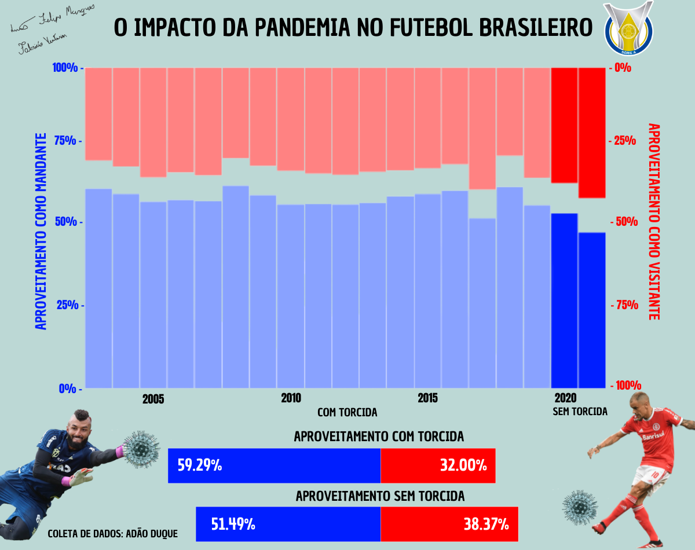

Bibliotecas para o markdown:

```{r message=FALSE, warning=FALSE}
library("knitr")
library("kableExtra")
library("htmltools")
```

```{r message=FALSE, warning=FALSE}
if(!require(ggplot2)) install.packages("ggplot2")
library(ggplot2)

if(!require(dplyr)) install.packages("dplyr")
library(dplyr)

if(!require(ggthemes)) install.packages("ggthemes")
library(ggthemes)
```

O banco de dados utilizados na parte 1 do trabalho foi:

https://github.com/adaoduque/Brasileirao_Dataset

```{r message=FALSE, warning=FALSE}
dados <- read.csv("campeonato-brasileiro-full.csv")
```

# Objetivo: O 12º homem em campo: eles fazem a diferença ou são apenas parte da decoração?

Algo muito comum de ouvir no futebol é "A torcida é o 12ª jogador do time". De fato, ao olhar para a análises da parte 1 do trabalho, é notório que o desempenho dos times jogando em casa é superior ao desempenho dos times jogando fora de casa. 

No entanto,muitos fatores podem influenciar isso.Porém, nas temporadas de 2020 e 2021 do brasileirão, por conta da pandemia, não houve a presença da torcida nos estádios. Nesse momento houve um estalo entre nós: será que de fato a torcida influencia no desempenho do time? e é sobre isso que iremos descobrir agora.

# Limpeza

Primeiramente, vamos excluir as colunas que não desejamos:

```{r message=FALSE, warning=FALSE}
excluir <- c("dia", "hora", "formacao_mandante", "formacao_visitante",
             "tecnico_mandante", "tecnico_visitante",
             "arena","visitante_estado","estado_vencedor")
dados <- dados[,!(names(dados)%in% excluir)]
head(dados)
```

Além disso, os jogos a partir de 08/12/2019 (última rodada da temporada 2019) foram sem a torcida. A partir de 05/10/2021 houve uma transição para a volta da torcida. Entretanto, como essa transição ocorreu de modo tímido e com poucos times, decidimos considerar os dados até tal data. 

```{r message=FALSE, warning=FALSE}
dados = dados[dados[["data"]] <= "2021-10-04", ]
```

# Criando os gráficos

Para criar uma tabela dos aproveitamentos de cada time, primeiro associamos novas variáveis times aos nossos dados. 

```{r message=FALSE, warning=FALSE}
if(!require(tidyr)) install.packages("tidyr")
library(tidyr)

dados <- dados %>%
  mutate(time_mandante = paste(Temporada, mandante)) %>%
  mutate(time_visitante = paste(Temporada, visitante))
head(dados)
```

Em seguida, adicionamos variáveis que descrevem quantos pontos cada time obteve de suas partidas.

```{r message=FALSE, warning=FALSE}
dados <- dados %>%
  mutate(pts_mandante = ifelse(mandante_placar > visitante_placar, 3, 
                               ifelse(mandante_placar < visitante_placar, 0, 1))) %>%
  mutate(pts_visitante = ifelse(mandante_placar < visitante_placar, 3, 
                                ifelse(mandante_placar > visitante_placar, 0, 1)))
head(dados)
```

Agora, podemos criar uma tabela que resume os desempenhos de cada time.

```{r message=FALSE, warning=FALSE}
times <- count(dados, time_mandante, Temporada, mandante_estado)
names(times)[1] <- "time"
names(times)[3] <- "estado"
names(times)[4] <- "jogos_em_casa"
times_2 <- count(dados, time_visitante)
names(times_2)[1] <- "time"
names(times_2)[2] <- "jogos_fora"

times <- merge(x = times, y = times_2, by = "time", all.x = TRUE)

pts_casa <- aggregate(pts_mandante ~ time_mandante, data = dados, FUN=sum)
names(pts_casa)[1] <- "time"
pts_fora <- aggregate(pts_visitante ~ time_visitante, data = dados, FUN=sum)
names(pts_fora)[1] <- "time"

times <- merge(x = times, y = pts_casa, by = "time", all.x = TRUE)
times <- merge(x = times, y = pts_fora, by = "time", all.x = TRUE)
times <- times %>%
  mutate(aprov_casa = pts_mandante/(3*jogos_em_casa)*100) %>%
  mutate(aprov_fora = pts_visitante/(3*jogos_fora)*100) %>%
  mutate(pts_tot = pts_mandante+pts_visitante) %>%
  mutate(aprov_tot = pts_tot/(3*(jogos_em_casa+jogos_fora))*100)
```

Por fim, podemos criar o gráfico do desempenho em casa e fora de casa em cada temporada

```{r message=FALSE, warning=FALSE}
d1 <- times %>% group_by(Temporada) %>% summarize(aprov_fora_md = mean(aprov_fora))
d2 <- times %>% group_by(Temporada) %>% summarize(aprov_casa_md = mean(aprov_casa))
cor <- c("#ff8282", "#ff8282", "#ff8282", "#ff8282", "#ff8282", "#ff8282", "#ff8282", "#ff8282", "#ff8282", "#ff8282", "#ff8282", "#ff8282", "#ff8282", "#ff8282", "#ff8282", "#ff8282", "#ff8282", "#ff0000", "#ff0000")
cor2 <- c("#89a2ff", "#89a2ff", "#89a2ff", "#89a2ff", "#89a2ff", "#89a2ff", "#89a2ff", "#89a2ff", "#89a2ff", "#89a2ff", "#89a2ff", "#89a2ff", "#89a2ff", "#89a2ff", "#89a2ff", "#89a2ff", "#89a2ff", "#001eff", "#001eff")
d <- merge(x = d2, y = d1)
grafico <- ggplot(d, aes(x = Temporada, y = 100)) + 
  geom_col(aes(y = 100), fill = cor, width=0.98) + 
  geom_col(aes(y = 100 - aprov_fora_md), fill = "white", width=0.98) + 
  geom_col(aes(y=aprov_casa_md), fill = cor2, width=0.98) +
  theme_void()
grafico
```

Vamos salvar o gráfico:

```{r message=FALSE, warning=FALSE}
ggsave("aproveitamento.png", grafico)
```

A seguir, criamos bases de dados que mostrar os aproveitamentos dos times. Esses dados foram divididos em duas bases, pré (2003-2019) e pós (2020-2021). A seguir, é tirada a média desses dados, e esses números são organizados num stacked bar com valores nagativos.

```{r message=FALSE, warning=FALSE}
dados_pre <- dados[dados[["data"]] <= "2020-01-01", ]
dados_pos <- dados[dados[["data"]] >= "2020-01-01", ]

times_pre <- count(dados_pre, time_mandante, Temporada, mandante_estado)
names(times_pre)[1] <- "time"
names(times_pre)[3] <- "estado"
names(times_pre)[4] <- "jogos_em_casa"
times_2 <- count(dados_pre, time_visitante)
names(times_2)[1] <- "time"
names(times_2)[2] <- "jogos_fora"

times_pre <- merge(x = times_pre, y = times_2, by = "time", all.x = TRUE)

pts_casa <- aggregate(pts_mandante ~ time_mandante, data = dados_pre, FUN=sum)
names(pts_casa)[1] <- "time"
pts_fora <- aggregate(pts_visitante ~ time_visitante, data = dados_pre, FUN=sum)
names(pts_fora)[1] <- "time"

times_pre <- merge(x = times_pre, y = pts_casa, by = "time", all.x = TRUE)
times_pre <- merge(x = times_pre, y = pts_fora, by = "time", all.x = TRUE)
times_pre <- times_pre %>%
  mutate(aprov_casa = pts_mandante/(3*jogos_em_casa)*100) %>%
  mutate(aprov_fora = pts_visitante/(3*jogos_fora)*100) %>%
  mutate(pts_tot = pts_mandante+pts_visitante) %>%
  mutate(aprov_tot = pts_tot/(3*(jogos_em_casa+jogos_fora))*100)

times_pos <- count(dados_pos, time_mandante, Temporada, mandante_estado)
names(times_pos)[1] <- "time"
names(times_pos)[3] <- "estado"
names(times_pos)[4] <- "jogos_em_casa"
times_2 <- count(dados_pos, time_visitante)
names(times_2)[1] <- "time"
names(times_2)[2] <- "jogos_fora"

times_pos <- merge(x = times_pos, y = times_2, by = "time", all.x = TRUE)

pts_casa <- aggregate(pts_mandante ~ time_mandante, data = dados_pos, FUN=sum)
names(pts_casa)[1] <- "time"
pts_fora <- aggregate(pts_visitante ~ time_visitante, data = dados_pos, FUN=sum)
names(pts_fora)[1] <- "time"

times_pos <- merge(x = times_pos, y = pts_casa, by = "time", all.x = TRUE)
times_pos <- merge(x = times_pos, y = pts_fora, by = "time", all.x = TRUE)
times_pos <- times_pos %>%
  mutate(aprov_casa = pts_mandante/(3*jogos_em_casa)*100) %>%
  mutate(aprov_fora = pts_visitante/(3*jogos_fora)*100) %>%
  mutate(pts_tot = pts_mandante+pts_visitante) %>%
  mutate(aprov_tot = pts_tot/(3*(jogos_em_casa+jogos_fora))*100)

times_pre <- times_pre %>%
  mutate(g = 1)
times_pos <- times_pos %>%
  mutate(g = 1)
pre_casa <- aggregate(times_pre$aprov_casa, by = list(times_pre$g), FUN = mean)$x[1]
pos_casa <- aggregate(times_pos$aprov_casa, by = list(times_pos$g), FUN = mean)$x[1]
pre_fora <- -aggregate(times_pre$aprov_fora, by = list(times_pre$g), FUN = mean)$x[1]
pos_fora <- -aggregate(times_pos$aprov_fora, by = list(times_pos$g), FUN = mean)$x[1]
dadao <- data.frame(
  cate = factor(c(2,1,2,1)),
  x = c(pre_casa, pos_casa, pre_fora, pos_fora)
)
grafico <- ggplot(dadao, aes(x=cate, y=x)) + 
  geom_bar(width = 0.6, 
           stat="identity", 
           position = position_stack(), 
           color="white", 
           fill = c("#001eff","#001eff","#ff0000","#ff0000"))+
  coord_flip() +
  theme_void()

grafico
```

Vamos salvar esse gráfico também

```{r message=FALSE, warning=FALSE}
ggsave("aproveitamento_geral.png", grafico, width = 21 )
```

# Criando a marca gráfica

Após desenvolver os dois gráficos, vamos, utilizando o site canva, juntar essas duas partes e criar a marca gráfica dos gráficos. 

Para a escolha das cores dos gráficos, decidimos remeter a duas cores consideradas opostas: o vermelho para representar os dados do time visitante e o azul para representar os dados do time mandante. Além disso, com o apoio da atividade de cores "transparentes", escolhemos outras duas cores que passam esse efeito, a fim de destacar as temporadas sem a presença dos torcedores. De cor de fundo, usaremos um cor neutra para destacar os gráficos. 

A anotação mais importante foi colocar os valores das porcentagens nos gráficos, pois, apesar da visualização das barras ajudar entender a diferença, poder visualizar os números em texto é de extrema importância.

Além disso, apesar de ser possível editar os eixos e os títulos no próprio R, não foi possível colocar nossa fonte de letra, e, por conta disso, decidimos reescrever os eixos e os títulos no próprio editor de imagem, levando em conta o horiginal. 

Por fim, aplicando o que foi ensinado no curso, o resultado final foi:

.

# Conclusão

Portanto, Os torcedores que vão aos jogos são parte fundamental do esporte, desde a energia que eles trazem até o dinheiro que eles gastam.

A falta da torcida afetou bastante o resultado dos jogos, visto que o aproveitamento dos times mandantes diminuio em relação às temporadas com torcida e o aproveitamento dos times visitantes melhorou sem a torcida rival.

Outra coisa interessante, ao pesquisar mais sobre o tema, é que o apoio da torcida e a responsabilidade extra de jogar na frente de uma multidão apaixonada podem elevar o desempenho de um jogador. "Essa energia te ajuda a dar 5 ou 10% a mais de você, e isso, você não consegue durante um treinamento", diz Martin, um jogador de futebol.

O futebol perde boa parte de sua beleza sem a presença das torcidas nos estádios. Os torcedores vivem sensações únicas em dias de jogo. Esses sentimentos são extremamente aflorados com toda a mística que é estar presente em uma partida de futebol.

